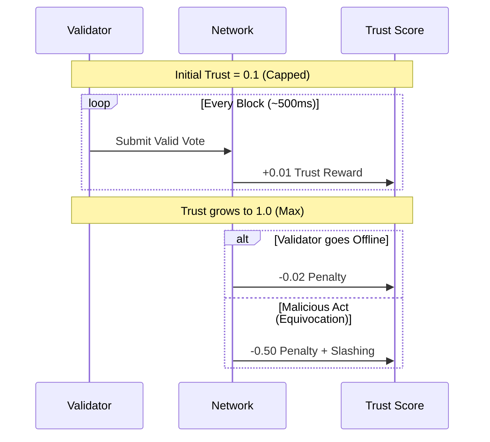

# SWIFT v2: Simple Weighted Instant Finality Trust


**SWIFT v2** is a next-generation Byzantine Fault Tolerant (BFT) consensus engine designed for speed, security, and self-healing. It introduces a novel **Hybrid Stake-Trust Model** that achieves single-round finality while actively punishing malicious behavior.

---

## 🚀 Key Features

| Feature | Description | Benefit |
|---------|-------------|---------|
| **⚡️ Single-Round Finality** | Blocks are finalized in one round (~500ms). | **2-3x faster** than HotStuff/Tendermint. |
| **🛡️ Hybrid Stake-Trust** | Voting power = `log(Stake) × Trust`. | Resists **Sybil attacks** & reduces whale dominance. |
| **❤️‍🩹 Self-Healing** | Trust decays for offline nodes; penalties for Byzantine acts. | Network automatically recovers from attacks. |
| **📉 Adaptive Quorum** | `max(67% Online, 51% Total)`. | Maintains **safety** during partitions & **speed** during calm. |
| **🔑 Production Crypto** | **BLS12-381** & **ECVRF**. | Industry-standard security & verifiable randomness. |

---

## 🏗️ Architecture

SWIFT v2 is built as a modular engine, ready to plug into any application layer (like Cosmos SDK).

```mermaid
graph TD
    User[User Transaction] --> Mempool[Transaction Pool]
    
    subgraph "SWIFT v2 Engine"
        Mempool --> Proposer[Leader Selection (VRF)]
        Proposer --> Block[Block Proposal]
        Block --> Vote[BLS Voting]
        Vote --> Agg[Signature Aggregation]
        Agg --> Final[Finalization]
        
        Final --> Trust[Trust Manager]
        Final --> Store[LevelDB / WAL]
    end
    
    Trust -->|Update Scores| Proposer
    Store -->|Persist State| Disk[(Disk Storage)]
```

### The "Trust Cycle"

Unlike traditional PoS, SWIFT v2 validators earn reputation over time.



---

## 🛠️ Quick Start

### Prerequisites
- Go 1.22+
- GCC (for BLS crypto)

### Installation

```bash
# Clone the repo
git clone https://github.com/swift-consensus/swift-v2.git
cd swift-v2

# Build the binary
go build -o swiftd ./cmd/swiftd
```

### Running a Node (LibP2P)

Start a single node with persistent storage:

```bash
./swiftd \
  -id 0 \
  -validators 1 \
  -network libp2p \
  -data-dir ./data/node0 \
  -stake 100000
```

*The node will generate keys, initialize the LevelDB store, and start producing blocks.*

---

## 🧠 How It Works

### 1. Leader Selection (VRF)
Leaders are selected deterministically but unpredictably using **ECVRF** (Verifiable Random Function).
- **Input:** Last Block Hash + Round Number + Private Key
- **Output:** A random value + A Zero-Knowledge Proof
- **Result:** You cannot grind/predict the next leader without the private key.

### 2. The Voting Power Formula
Your influence is not just how much money you have.

```math
\text{Weight} = \log_2\left(\frac{\text{Stake}}{\text{MinStake}} + 1\right) \times \text{TrustScore}
```

*   **Logarithmic Stake:** Prevents a single billionaire from buying the network.
*   **Trust Multiplier:** A rich but malicious node has `Trust = 0`, so `Weight = 0`.

### 3. Adaptive Quorum
The network adjusts to conditions automatically.

*   **Sunny Day:** Quorum is **67% of Online Weight**. Fast!
*   **Rainy Day (Partition):** Quorum floor is **51% of Total Weight**. Safe!

---

## 🔒 Security Audit

The codebase has undergone rigorous auditing (Jan 2026).

*   ✅ **Vote Replay Protection:** Fixed & Verified.
*   ✅ **Equivocation Proofs:** Cryptographically enforced.
*   ✅ **DoS Protection:** Transaction pool limits & signature checks.
*   ✅ **Data Safety:** Write-Ahead Log (WAL) with CRC checksums.

---

## 🗺️ Roadmap

- [x] **Core Consensus Engine** (Completed)
- [x] **P2P Networking** (Completed)
- [x] **Persistence Layer** (Completed)
- [ ] **Cosmos SDK Integration (ABCI)** (Next Step)
- [ ] **Light Client Support**
- [ ] **Mainnet Launch**

---

## 📄 License

This project is licensed under the **MIT License**.

---

*Built with ❤️ by the SWIFT Research Team.*