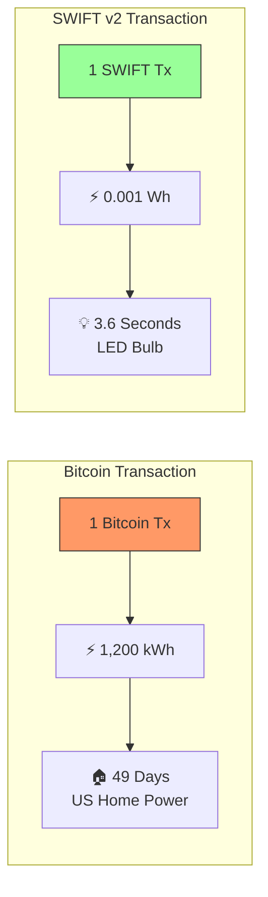
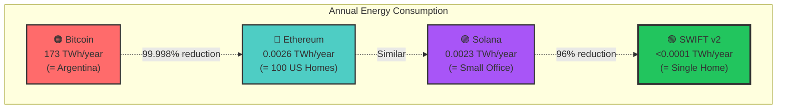
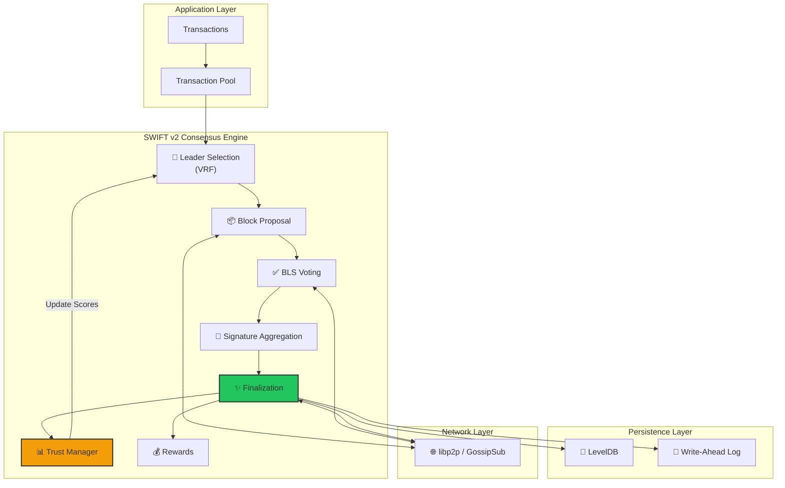
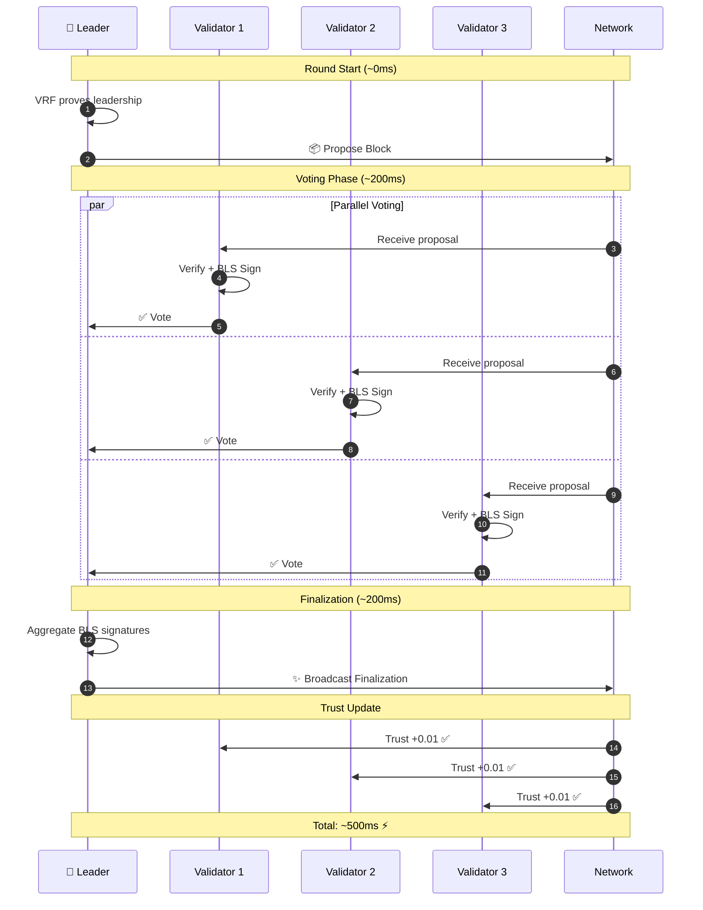
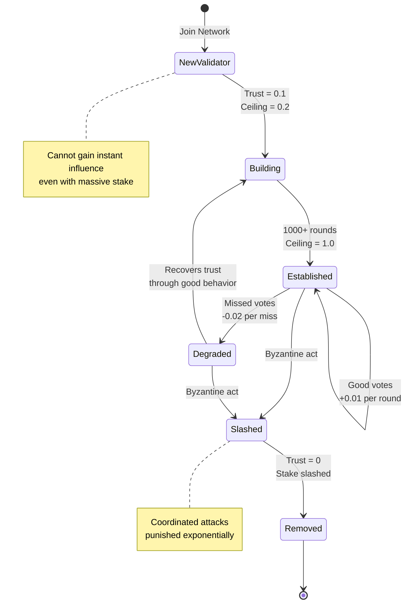
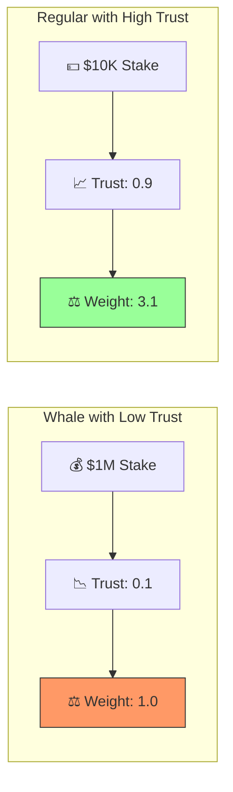
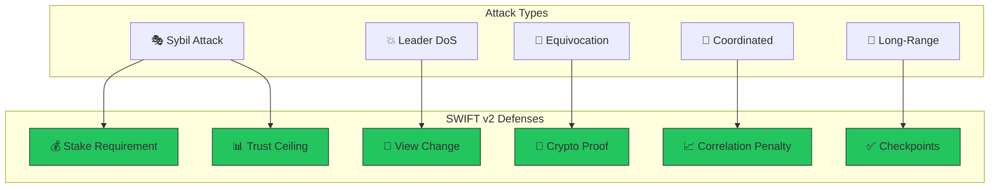

# SWIFT v2: Simple Weighted Instant Finality Trust


## The Eco-Friendly, Self-Healing Blockchain Consensus

**SWIFT v2** is a next-generation Byzantine Fault Tolerant (BFT) consensus protocol that proves blockchain doesn't have to cost the Earth. We achieve **sub-second finality** with **99.9999% less energy** than Bitcoin.

---

## 🌍 The Problem We Solve

### For Everyone (No Tech Background Needed)

Every time someone sends Bitcoin, the electricity used could power your home for **49 days**.



**Why?** Bitcoin uses "Proof of Work" - millions of computers racing to solve puzzles 24/7, wasting energy on a global lottery just to add transactions.

**SWIFT v2's Solution:** A trusted committee that votes. No puzzles. No wasted energy. Transactions finalize in 0.5 seconds.

### For Developers (Technical Summary)

SWIFT v2 is a BFT consensus achieving:
- **Single-round finality** (~500ms vs 3 rounds in HotStuff)
- **O(n) message complexity** via BLS12-381 signature aggregation
- **Self-healing** through trust-weighted voting
- **~0.001 Wh/transaction** energy consumption

---

## ⚡ Energy Comparison



| Metric | Bitcoin | Ethereum | Solana | **SWIFT v2** |
|--------|---------|----------|--------|--------------|
| **Energy/Tx** | 1,200 kWh | 0.03 kWh | 0.002 Wh | **0.001 Wh** |
| **Annual** | 173 TWh | 0.0026 TWh | 0.0023 TWh | **<0.0001 TWh** |
| **Finality** | ~60 min | ~13 min | ~0.4 sec | **~0.5 sec** |
| **Self-Healing** | ❌ | ❌ | ❌ | **✅** |

---

## 🚀 Key Features

| Feature | Description | Benefit |
|---------|-------------|---------|
| **⚡ Single-Round Finality** | Blocks finalize in one round (~500ms) | **2-3x faster** than HotStuff/Tendermint |
| **🌱 Eco-Friendly** | ~0.001 Wh per transaction | **99.9999% less** energy than Bitcoin |
| **🛡️ Hybrid Stake-Trust** | `weight = log(Stake) × Trust` | Resists Sybil attacks + reduces whale dominance |
| **❤️‍🩹 Self-Healing** | Bad actors automatically lose influence | Network recovers without manual intervention |
| **📉 Adaptive Quorum** | `max(67% Online, 51% Total)` | Fast when healthy, safe under attack |
| **🔐 Production Crypto** | BLS12-381 + ECVRF | Industry-standard security |

---

## 🏗️ Architecture

### System Overview



### Consensus Flow (Single Round)



---

## 🧠 The Trust System: Self-Healing Networks

### Why Trust Matters

Traditional blockchains punish bad actors **after** damage. SWIFT v2 prevents damage by degrading influence **before** attacks succeed.

```mermaid
graph TB
    subgraph "Traditional PoS"
        A1[Attacker Joins] --> A2[Builds Stake]
        A2 --> A3[Executes Attack]
        A3 --> A4[Damage Done ❌]
        A4 --> A5[Slashing Occurs]
        A5 --> A6[Too Late 😢]
    end

    subgraph "SWIFT v2"
        B1[Attacker Joins] --> B2[Low Trust Ceiling 0.2]
        B2 --> B3[Tries to Attack]
        B3 --> B4[Insufficient Weight ✅]
        B4 --> B5[Trust Drops to 0]
        B5 --> B6[Network Safe 🛡️]
    end

    style A4 fill:#f96,stroke:#333
    style A6 fill:#f96,stroke:#333
    style B4 fill:#9f9,stroke:#333
    style B6 fill:#9f9,stroke:#333
```



### Trust Lifecycle



### Trust Updates

| Event | Trust Change | Example |
|-------|--------------|---------|
| ✅ Correct vote | **+0.01** | 0.50 → 0.51 |
| ❌ Missed vote | **-0.02** | 0.50 → 0.48 |
| 🚨 Byzantine (solo) | **-0.10** | 0.50 → 0.40 |
| 🚨 Byzantine (40 attackers) | **-0.50** | 0.50 → 0.00 |
| 📉 Decay per round | **×0.9999** | Prevents hoarding |

### Graduated Trust Ceiling

New validators can't dominate immediately, even with huge stake:

```mermaid
gantt
    title Trust Ceiling Over Time
    dateFormat X
    axisFormat %s rounds

    section Trust Ceiling
    Max 0.20    :a1, 0, 100
    Max 0.40    :a2, 100, 250
    Max 0.60    :a3, 250, 500
    Max 0.80    :a4, 500, 1000
    Max 1.00    :a5, 1000, 1500
```



| Rounds Active | Max Trust | Real Time (500ms blocks) |
|---------------|-----------|--------------------------|
| 0-100 | 0.20 | ~1 hour |
| 101-250 | 0.40 | ~2 hours |
| 251-500 | 0.60 | ~4 hours |
| 501-1000 | 0.80 | ~8 hours |
| 1000+ | 1.00 | 8+ hours |

**Result:** Sybil attacks need 8+ hours to gain meaningful influence—plenty of time for detection.

---

## 📊 The Voting Weight Formula

Your influence is **not** just how much money you have:

```
weight = log₂(stake / MIN_STAKE + 1) × effective_trust
```



| Stake | Trust | Weight | Notes |
|-------|-------|--------|-------|
| $1,000 (min) | 1.0 | 1.0 | Baseline |
| $10,000 | 1.0 | 3.46 | 10x stake ≠ 10x power |
| $100,000 | 1.0 | 6.66 | 100x stake ≠ 100x power |
| $1,000,000 | 0.1 | 1.0 | Rich but untrusted = weak |
| $10,000 | 0.9 | 3.11 | Reliable = powerful |

---

## 🛠️ Quick Start

### Prerequisites
- Go 1.22+
- GCC (for BLS crypto)

### Installation

```bash
# Clone
git clone https://github.com/swift-consensus/swift-v2.git
cd swift-v2

# Build
go build -o swiftd ./cmd/swiftd

# Run tests
go test ./...
```

### Run a Local Network

```bash
# Terminal 1 - Validator 0
./swiftd -id 0 -validators 4 -network mock

# Terminal 2 - Validator 1
./swiftd -id 1 -validators 4 -network mock

# Terminal 3 - Validator 2
./swiftd -id 2 -validators 4 -network mock

# Terminal 4 - Validator 3
./swiftd -id 3 -validators 4 -network mock
```

### Production Mode (libp2p + Persistence)

```bash
./swiftd \
  -id 0 \
  -validators 4 \
  -network libp2p \
  -p2p-port 9000 \
  -data-dir ./data \
  -stake 100000
```

---

## 🔒 Security

### Attack Resistance



### Security Audit Status (January 2026)

| Category | Issues Found | Status |
|----------|--------------|--------|
| Critical | 5 | ✅ All Fixed |
| High | 8 | ✅ All Fixed |
| Medium | 8 | ✅ All Fixed |
| **Total** | **21** | **✅ Complete** |

---

## 📁 Project Structure

```
swift-v2/
├── cmd/swiftd/           # Node binary
├── consensus/            # Core consensus engine
│   ├── swift.go          # Main orchestrator
│   ├── leader.go         # VRF leader selection
│   ├── voting.go         # Vote handling
│   ├── finalize.go       # Block finalization
│   ├── viewchange.go     # View change protocol
│   └── quorum.go         # Adaptive quorum
├── trust/                # Self-healing trust system
│   ├── manager.go        # Trust scores
│   ├── ceiling.go        # Graduated ceiling
│   └── byzantine.go      # Byzantine detection
├── stake/                # Stake management
├── crypto/               # BLS12-381, VRF
├── storage/              # LevelDB + WAL
├── network/              # libp2p transport
└── types/                # Data structures
```

---

## 📚 Documentation

- [WHITEPAPER.md](WHITEPAPER.md) - Complete technical specification with energy analysis
- [CLAUDE.md](CLAUDE.md) - Development guide and security audit details

---

## 🤝 Contributing

1. Fork the repository
2. Create feature branch (`git checkout -b feature/amazing`)
3. Commit changes (`git commit -m 'Add amazing feature'`)
4. Push to branch (`git push origin feature/amazing`)
5. Open a Pull Request

---

## 📄 License

MIT License - see [LICENSE](LICENSE) for details.

---

## 📖 References

**Energy Data:**
- [Bitcoin Energy Index](https://digiconomist.net/bitcoin-energy-consumption) - Digiconomist
- [Ethereum Energy](https://ethereum.org/energy-consumption) - Ethereum Foundation
- [Solana Energy Report](https://solana.com/news/solanas-energy-use-report-september-2022) - Solana Foundation

**Protocol Design:**
- BLS Signatures - Boneh, Lynn, Shacham (2001)
- PBFT - Castro, Liskov (1999)
- HotStuff - Yin et al. (2019)

---

<div align="center">

**SWIFT v2** - Fast, Secure, and Green Consensus

*Built for a sustainable blockchain future* 🌱

</div>
